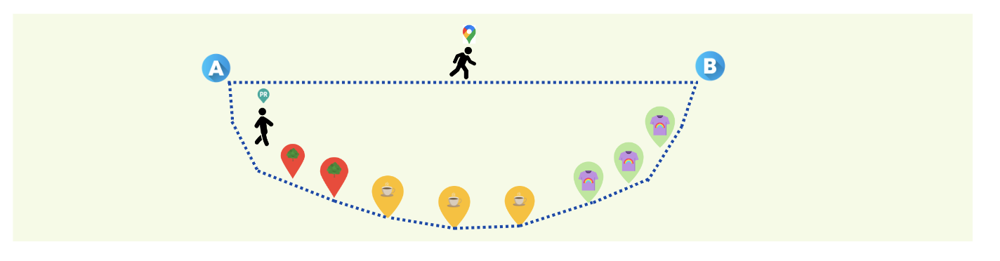

# Personalized Routes: Network Analysis and Shortest Path Algorithm

Current routing systems are utterly optimized to offer the route that guarantees the minimum amount of time to commute from one point to another.

However, sometimes we are not in such a rush to get to a certain place but rather prefer a more joyful track that assures us to be walking by parks. Or maybe if we need to shop a certain item, the route could be optimized to get us to nearby shoping areas while bringing us to the final destination.

With the aim of making each route more than just a simple fast transfer, we propose a recommended route creator. In it, the path will not only take into account the optimization of distance, but also the user's interests. In this way, the route will be slightly modified to pass by local stores and businesses that can attract their attention and that, in some way, can make the walk a more pleasant moment to enjoy and disconnect from the rush. In addition to meeting other day-to-day needs, such as shopping for clothes, the pharmacy, bazaars or travel agencies.

This repository is not a ready2go implementation that can be used ...

## Repository Organization

# _Data_

Data needed for the different calculations and map representations is contained in: 

＊ `Datasets`: folder with data regarding the shops, its type (_category belonging_) and its location.

＊ `Shapefiles`: folder with data points and lines that conform the city points and its streets.

＊ `Graphs`:  folder with pickled graphs of the cities. Can be used as an alternative to working with shapefiles, with pre-calculations that allow a faster implementation. When working with this data type, the `openstreetmap` library is used to handle the information.

＊ `Relations`: folder with information about all the stabliments nearby every point in one of the cities of study, with a tolerance of _50 points_ in any direction in latitude or longitude.

# _Notebooks_

This repository consists of 3 core notebooks.

#### `dataset_preprocessing`

Notebook consisting of a descriptive analisis of the datasets that contain all shops for the different cities considered in this project. Also a section with the preprocessing methodology implemented is exposed in the second part of the notebook. Data used is available in the folder `Datasets`.

#### `network_analysis_experiments`

This notebook introduces and describes the data that is used to obtain the routes and map representations. The data the notebook uses are the `shapefiles` of Barcelona. However, It's also available the `shapefile` of New York city, London and Madrid. 

#### `route_algorithm`

The strategy followed to obtain the personalized route is the following, given 2 points and a direction:

1️⃣ _Dijkstra's algorithm_ is implemented to obtain the fastest route

2️⃣ For all points conforming the route, all stabliments in a distance of _50 units_ from the longitude and latitude will be candidates to be added to the route. The pre-calculated csv file `<city>_relations` in `Relations`' folder is used in this stage.

3️⃣ Only those stabliments that belong to the categories of interest of the user will be taken into account. After this filter... 

   ﹡ If the number of nearby stabliments is $\leq 5$ , then the route will pass through all the points.

   ﹡ Otherwise, a 2nd filter will be performed via _*random selection*_ or selectiong those points that guarantee the _*shortest path*_.

See the notebook referenced in this section to have a practical view of the process detailed in this lines.

