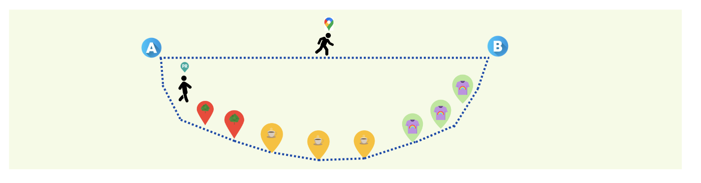

# Personalized Routes: Network Analysis and Shortest Path Algorithm

We live in a society where everything happens very fast, in a continuous race against ourselves to, let's say, make the most of every moment. No one wants to feel that they are wasting time. But it is often in the small moments when we forget about everything or think only about our life that we enjoy it to the fullest.

This is why current routing systems fail in their attempt to improve this aspect as they only recommend the fastest routes, which are guaranteed to enhance the user's feeling of not dawdling. But are we always in such a hurry? Do we want to spend our lives rushing from one place to another without even thinking about where we are going?

With all of the above in mind and with the aim of making each route more than just a simple transfer, we propose a recommended route creator. In it, the path will not only take into account the optimization of distance, but also the user's interests. In this way, the route will be slightly modified to pass by local stores and businesses that can attract their attention and that, in some way, can make the walk a more pleasant moment to enjoy and disconnect from the rush. In addition to meeting other day-to-day needs, such as shopping for clothes, the pharmacy, bazaars or travel agencies.

## Usage

Look at the notebooks
