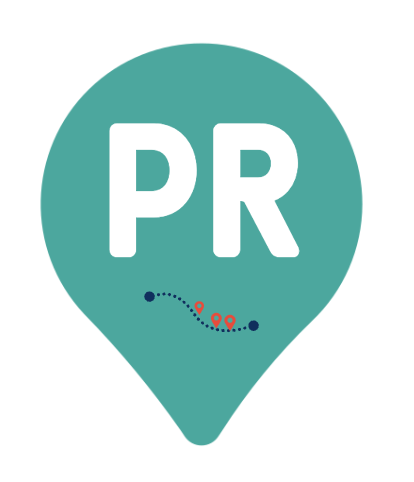

# Personalized Routes: Network Analysis and Shortest Path Algorithm

Current routing systems are utterly optimized to offer the route that guarantees the minimum amount of time to commute from one point to another.

However, sometimes we are not in such a rush to get to a certain place but rather prefer a more joyful track that assures us to be walking by parks. Or maybe if we need to shop a certain item, the route could be optimized to get us to nearby shoping areas while bringing us to the final destination.

With the aim of making each route more than just a simple fast transfer, we propose a recommended route creator. In it, the path will not only take into account the optimization of distance, but also the user's interests. In this way, the route will be slightly modified to pass by local stores and businesses that can attract their attention and that, in some way, can make the walk a more pleasant moment to enjoy and disconnect from the rush. In addition to meeting other day-to-day needs, such as shopping for clothes, the pharmacy, bazaars or travel agencies.

